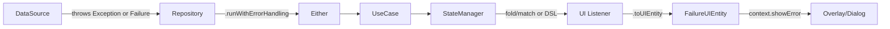

# ADR-005: Errors Management Strategy — Declarative & Type-Safe Failures

## 1. Context (Problem & Goals)

Error handling is a **first-class concern** in production-grade apps. Within a **State‑Symmetric Architecture (SSA)**, the error management layer must remain **modular, predictable, and state‑manager agnostic**, ensuring consistent flows across Riverpod, Bloc/Cubit, and pure Dart.

**Problems to solve**

- Map raw SDK/platform exceptions (SocketException, TimeoutException, PlatformException, etc.) **and structured SDK errors** (DioException, FBException) into **structured, domain‑level Failures**.
- Provide a **type‑safe, composable result model** (`Either<Failure, T>`) across repositories, use cases, and UI.
- Ensure **one‑shot UI feedback** (overlays/dialogs) without duplication or stale errors.
- Support **both user-driven and automatic retry** in transient failures (e.g., network timeouts).
- Preserve **clean architecture boundaries**: Data layer may throw raw Exceptions or Failures → repository maps via `.runWithErrorHandling()` → propagates `Either<Failure, T>`.

**Design constraints**

- **Symmetry** across Riverpod and Bloc/Cubit (no vendor lock‑in).
- **Type safety & testability** with functional constructs (`Either`, `ResultFuture`, `Consumable`).
- **Extensibility**: easy to add new `FailureType` and mappings for SDKs/APIs.
- **Declarative feedback**: UI never shows raw errors, only mapped `FailureUIEntity`.

---

## 2. Decisions (Concise)

1. **Functional Result Model**
   Use **`Either<Failure, T>`** as the universal return type for repositories and use cases (`ResultFuture<T>` for async).

2. **Failure as Single Source of Truth**
   - Domain‑level entity `Failure` encapsulates `FailureType`, optional message, and status code.
   - `FailureType` provides stable **code + translationKey** for i18n.

3. **Mapping Layer**
   - Centralized `mapToFailure()` extension maps Exceptions and structured SDK errors to `Failure`.
   - Dedicated mappers for **Dio**, **Firebase** (with `GenericFirebaseFailureType` fallback for unknown codes), **Platform**, **IO**.
   - If `Failure` is thrown directly → pass through (no remapping).

4. **UI Entities**
   - `Failure.toUIEntity()` maps `Failure` → `FailureUIEntity` (localized text, icon, safe code).
   - UI never consumes `Failure` directly — only `FailureUIEntity`.

5. **One‑Shot Consumption**
   - **Bloc/Cubit**: emit `Consumable<FailureUIEntity>`; consumed once in `BlocListener`.
   - **Riverpod**: use `ref.listenFailure`, which triggers callback only once per state change (built‑in one‑shot via `ref.listen()`; no Consumable wrapper needed).

6. **DSL‑like & Classic Styles**
   - Support both:
     • **Classic**: `.fold()` / `.match()` directly on `Either` (explicit, inline, simple flows).
     • **DSL‑like**: `ResultHandler(result).onSuccess(...).onFailure(...).log()` (chainable wrapper for complex flows).

7. **Overlay Integration**
   - Only `context.showError(FailureUIEntity)` or `ref.listenFailure(...)` allowed.
   - No inline `.toString()` or raw messages in widgets.

8. **Retryability Principle**
   - **UI-driven retry**: `Failure.isRetryable` → retry button in UI → re‑invokes UseCase.
   - **Automatic retry**: `.retry(task: ...)` extension for transient network errors.

---

## 3. Consequences

### Positive

- **Unified contract** for all layers, all state managers.
- **Strictly type‑safe**: no exceptions leak beyond Data layer.
- **Extensible**: new SDKs/APIs extend via `failure_types/` and `exceptions_mapping/`.
- **Clean boundaries**: separation of data errors, domain failures, and UI overlays.
- **High testability**: functional constructs simplify unit/integration tests.
- **Declarative UX**: overlays, retries, logging, and localization are plug‑and‑play.

### Negative

- **Boilerplate overhead**: each new SDK requires mapper + `FailureType` + translation key (mitigated by templates in `extensible_part/`).
- **Learning curve**: developers must be comfortable with `Either` and FP patterns.
- **Initialization discipline**: overlays/loggers must be wired at bootstrap.

---

## 4. Success Criteria & Alternatives

### Success Criteria

- ✅ All repository methods return `ResultFuture<T>` or `Either<Failure, T>`
- ✅ No raw exceptions escape repositories (enforced via linter or code review)
- ✅ All `FailureType` instances have `translationKey` (validated by unit tests)
- ✅ One‑shot overlays validated by integration tests (Riverpod vs Bloc parity)
- ✅ Retry flows tested: user-driven and automatic retry consistent

### Alternatives Considered

- **Raw Exceptions** — rejected: leaks infra details into domain/UI, untestable, unsafe.
- **Try/Catch in UI** — rejected: pollutes widgets, no centralization.
- **Only Flutter `ErrorWidget`** — rejected: not user‑friendly, not localized.

---

## 5. Summary

The adopted approach establishes a **modular, type‑safe, declarative error pipeline**:

**Flow:**

- DataSource may throw Exception or Failure
- Repository maps → `Failure` (or passes Failure through) via `.runWithErrorHandling()`
- Use cases propagate `Either<Failure, T>`
- State managers fold/match or use DSL handlers
- UI consumes only `FailureUIEntity` via overlays
- One‑shot consumption ensured via `Consumable` (Bloc) or `ref.listenFailure` (Riverpod)

This guarantees **predictable, localized, and testable** error handling, symmetric across Bloc, Riverpod, and headless tasks.

---

## 6. Related Information

**Module Docs**

- [`README(errors_handling).md`](../packages/core/lib/src/base_modules/errors_management/README%28errors_handling%29.md) — main usage, examples, troubleshooting.
- [`README(localization).md`](../packages/core/lib/src/base_modules/localization/README%28localization%29.md) — localization keys and translation strategies.
- [`README(overlays).md`](../packages/core/lib/src/base_modules/overlays/README%28overlays%29.md) — how overlays integrate with `FailureUIEntity`.
- [`README(form_fields).md`](../packages/core/lib/src/base_modules/form_fields/README%28form_fields%29.md) — mapping validation errors via `uiErrorKey`.

**Related ADRs**

- [ADR-001 — State‑Symmetric Architecture](ADR-001-State-symmetric-architecture.md)
- [ADR-003 — Navigation & Routing](ADR-003-GoRouter-navigation.md)
- [ADR-004 — Localization Strategy](ADR-004-EasyLocalization.md)

**References**

- [Functional Error Handling in Dart / FP libraries](https://pub.dev/packages/fpdart)
- [Bloc Documentation — Error Handling](https://bloclibrary.dev/#/)
- [Riverpod Documentation — AsyncValue Errors](https://riverpod.dev/docs/concepts/providers/#handling-errors)
