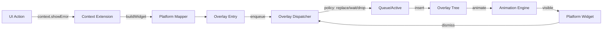

# ADR-006: Overlays Management Strategy — Platform‑Adaptive & Conflict‑Aware UI Feedback

## 1. Context (Problem & Goals)

Within a **State‑Symmetric Architecture (SSA)** the overlay system must be **modular, conflict‑aware, platform‑adaptive**, and **state‑manager agnostic**, providing consistent behavior across Riverpod, Bloc/Cubit, and headless Dart.

**Problems to solve**

- Provide a single public API for overlays with **platform adaptation** (Material/Cupertino).
- **Prevent conflicts**: duplicates, overlapping dialogs, race conditions.
- **Priorities & queueing**: critical/high/normal/userDriven plus replacement policies.
- **Declarative, type‑safe API** via context extensions (`context.showError()`, `context.showUserDialog()`).
- **Navigation safety**: auto‑cleanup on page‑level route changes (no leaks across screens).
- **Tap‑through UX** for non‑blocking overlays (banners/snackbars).
- Tight integration with the **error pipeline** (`FailureUIEntity → overlay`).

**Design constraints**

- **Platform symmetry**: iOS → Cupertino visuals; Android → Material visuals; one behavior.
- **State‑agnostic**: accessed via DI port (dispatcher locator), no coupling to specific state managers.
- **Conflict‑aware**: priorities + replacement/queue/drop policies.
- **Declarative API**: only context extensions, never ad‑hoc `showDialog(...)`.
- **Navigation‑aware**: cleans on page transitions, ignores popup routes.
- **Animation engine**: centralized curves, blur, and lifecycle.
- **Accessibility**: honors SafeArea, Reduced Motion, and screen readers.

---

## 2. Decisions (Concise)

### 2.1 Unified Context Extensions

All overlays are triggered via:

- `context.showError(FailureUIEntity, ...)`
- `context.showUserDialog(...)`
- `context.showUserBanner(...)`
- `context.showUserSnackbar(...)`

These delegate to low‑level builders (`showBanner()`, `showSnackbar()`, `showAppDialog()`), which construct platform‑specific widgets.

### 2.2 Overlay Dispatcher (Central Manager)

`OverlayDispatcher` is responsible for:

- **Queueing** (FIFO with priorities),
- **Conflict resolution** (via `OverlayReplacePolicy`),
- **Lifecycle** (insert/dismiss, active state),
- **Per‑category debounce**.

Accessed through DI: `resolveOverlayDispatcher(context)` or a global resolver.

### 2.3 Platform‑Adaptive Widget Mapping

`PlatformMapper` builds platform‑specific widgets:

- iOS: `IOSAppDialog`, `IOSBanner`, `IOSToastBubble` (glassmorphism),
- Android: `AndroidDialog`, `AndroidBanner`, `AndroidSnackbarCard`.

All widgets are wrapped by a shared `AnimationEngine`.

### 2.4 Overlay Entries as Descriptors

Types: `DialogOverlayEntry`, `BannerOverlayEntry`, `SnackbarOverlayEntry`.
Each entry defines:

- `OverlayConflictStrategy` (priority + policy + category),
- `OverlayDismissPolicy` (dismissible/persistent),
- `tapPassthroughEnabled` (true for banner/snackbar),
- `buildWidget()` (platform‑aware, animated).

### 2.5 Conflict Resolution Policies

`OverlayReplacePolicy` options:

- `forceReplace`, `forceIfSameCategory`, `forceIfLowerPriority`,
- `dropIfSameType`, `waitQueue`.

Default mapping by **priority**:

- `critical` → `forceReplace`
- `high` → `forceIfLowerPriority`
- `normal` → `forceIfSameCategory`
- `userDriven` → `waitQueue`

### 2.6 Tap‑Through & Dismissal

`TapThroughOverlayBarrier` enables **tap‑through** for banners/snackbars and controlled dismissal when allowed by policy.

### 2.7 Navigation‑Aware Cleanup

`OverlaysCleanerWithinNavigation` (NavigatorObserver) **clears the queue** on **page‑level** transitions (push/pop/remove/replace). Popup routes are ignored. The current active overlay is not forcibly killed.

### 2.8 Global Overlay Handler

`GlobalOverlayHandler` wraps screens/areas to:

- dismiss keyboard on outside tap,
- dismiss the active overlay (if policy allows).

### 2.9 UI Presets

Immutable presets: `OverlayErrorUIPreset`, `OverlaySuccessUIPreset`, `OverlayWarningUIPreset`, `OverlayInfoUIPreset`, `OverlayConfirmUIPreset` → `OverlayUIPresetProps` (icon, color, duration, margin, shape, padding, behavior). Supports `.withOverride(...)` for minor tweaks without new classes.

### 2.10 Error Handling Integration

`context.showError(FailureUIEntity)` with `ShowAs` (dialog/infoDialog/banner/snackbar). Works with `Consumable<FailureUIEntity>` (BLoC) and `ref.listenFailure(...)` (Riverpod).

### 2.11 State Exposure

`OverlayActivityPort` and `OverlayActivityWatcher` expose reactive activity to the UI (e.g., disable submit while overlay is active). `SubmitCompletionLockController` removes post‑submit button flicker by unlocking on overlay activation or fallback timeout.

### 2.12 Debouncing per Category

`OverlayPolicyResolver.getDebouncer(category)` prevents rapid re‑triggering:

- banner/snackbar → ~500ms,
- dialog → no delay.

### 2.13 Adapters & App Wiring (Bloc/Cubit & Riverpod)

The overlay system is state‑agnostic by design. Thin adapters in each app flavor connect core ports to state managers:

Core ports (in core): OverlayActivityPort (dispatcher → app) and OverlayActivityWatcher (app → lock controller) form the abstraction contract. Dispatcher resolvers (setOverlayDispatcherResolver, setGlobalOverlayDispatcherResolver) expose a single OverlayDispatcher instance via DI.

Bloc/Cubit adapter: maintains overlay activity in a global OverlayStatusCubit; provides a BlocOverlayActivityPort (dispatcher updates → cubit) and BlocOverlayWatcher (cubit stream → watcher). Wiring helpers register resolvers in GetIt. SubmitCompletionLockController can be plugged with BlocOverlayWatcher.

Riverpod adapter: maintains overlay activity in a keep‑alive provider (overlayStatusProvider); provides a RiverpodOverlayActivityPort (dispatcher updates → provider) and RiverpodOverlayWatcher (provider listener → watcher). Wiring helpers install resolvers into ProviderContainer. Utilities like ref.isOverlayActive allow easy consumption.

Headless/background tasks: global resolvers enable overlays to be triggered outside widget trees (navigators, observers, background infra). Cleanup logic and post‑frame updates use the same global dispatcher instance.

This ensures symmetry across Bloc and Riverpod apps while keeping the overlay core independent of any state manager.

---

## 3. Consequences

**Positive**

- Unified, **conflict‑aware** overlay pipeline for iOS/Android.
- **Declarative** API via context extensions (no ad‑hoc calls).
- **Navigation safety**: no leaks across screens.
- **Polished animations** via a centralized engine.
- **Testable**: Dispatcher is isolated and mockable.
- **Extensible**: new types/presets/policies without touching the core.
- **Open/Closed Principle**: Easy to add a new overlay types (require entry + platform widgets + optional preset).

**Negative**

- **Bootstrap discipline**: dispatcher resolvers must be wired at startup.
- **Learning curve**: priorities/policies/queueing need to be understood.
- **DI indirection**: dispatcher accessed via a port rather than direct constructors.
- **Animation coupling**: overlays depend on the AnimationEngine module.

---

## 4. Success Criteria & Alternatives

**Success Criteria**

- ✅ All overlays use **only** context extensions (no manual `showDialog` / `ScaffoldMessenger`).
- ✅ **No duplicates/overlaps**: replacement/queue/drop policies enforce uniqueness.
- ✅ **Platform‑adaptive**: iOS uses Cupertino, Android uses Material (integration‑tested).
- ✅ **Navigation safety**: queue cleared on page transitions (NavigatorObserver tests).
- ✅ **Tap‑through UX** for banner/snackbar (manual scenarios + golden screenshots).
- ✅ **Error integration**: `FailureUIEntity` is always displayed via overlays (never raw text in widgets).
- ✅ **Accessibility**: Reduced Motion respected; overlay content readable by screen readers.

**Alternatives Considered**

- Manual `showDialog()` / `ScaffoldMessenger`: rejected (no central policies/queue/adaptation).
- Third‑party overlay libraries: rejected (vendor lock‑in, poor SSA/DI fit).
- No queue/priority system: rejected (duplicates, race conditions).

---

## 5. Summary

The strategy establishes a **platform‑adaptive, conflict‑aware** overlay pipeline with a declarative API:

**One‑shot consumption**:

- **Riverpod**: `ref.listenFailure(provider, context)` — one trigger per state change (built‑in by `ref.listen()`; no `Consumable` needed).
- **Bloc/Cubit**: `Consumable<FailureUIEntity>` — consumed once inside `BlocListener`.

Result: **predictable, native, conflict‑free** overlays with symmetric behavior for Bloc/Riverpod and iOS/Android.

---

## 6. Related Information

**Module Docs**

- [README(overlays).md](../packages/core/lib/src/base_modules/overlays/README%28overlays%29.md) — usage, examples, troubleshooting
- [README(errors_handling).md](../packages/core/lib/src/base_modules/errors_management/README%28errors_handling%29.md) — error‑pipeline integration
- [README(animations).md](../packages/core/lib/src/base_modules/animations/README%28animations%29.md) — `AnimationEngine` details

**Related ADRs**

- [ADR‑001 — State‑Symmetric Architecture](ADR-001-State-symmetric-architecture.md)
- [ADR‑003 — Navigation & Routing](ADR-003-GoRouter-navigation.md)
- [ADR‑005 — Errors Management Strategy](ADR-005-Errors-management.md)

**References**

- [Flutter Overlay API](https://api.flutter.dev/flutter/widgets/Overlay-class.html) (Overlay / OverlayEntry / NavigatorObserver)
- [Material Design — Snackbars](https://m3.material.io/components/snackbar/overview)
- [Cupertino Design — Alerts/Sheets](https://developer.apple.com/design/human-interface-guidelines/alerts)
